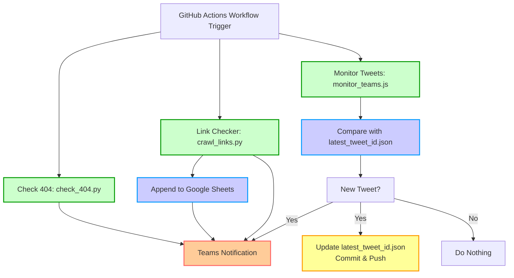

# flow.md

# 実行フロー概要

本リポジトリの GitHub Actions およびスクリプトがどのように連携しているかを概念的に示したフローです。

---

## フロー詳細

1. **Check 404: `check_404.py`**  
   - 事前に設定されたサイトマップ (`digi-mado.jp/sitemap.xml` など) から全 URL を取得。  
   - 各ページに対して GET リクエストを送り、ステータスコードを確認。  
   - 404 エラーがあれば Teams にまとめて通知。

2. **Link Checker: `crawl_links.py`**  
   - トップページ (`https://digi-mado.jp/` など) からリンクを再帰的に収集。  
   - 内部リンクは再度クロール対象としてキューに追加し、外部リンクは HEAD リクエストで 404 チェックを実施。  
   - 検出したリンク切れを Google Sheets に追記し、最後に Teams に通知。

3. **Monitor Tweets: `monitor_teams.js`**  
   - @googlesearchc のユーザID (例: `22046611`) に対して Twitter API v2 で最新ツイートを取得。  
   - ローカルファイル `latest_tweet_id.json` 内のID と比較し、新しいツイートID なら Teams に投稿して JSON を更新。  
   - JSON 更新後、GitHub Actions 上で自動コミット・プッシュし、最新ツイートID を履歴管理。

4. **Teams Notification**  
   - 各スクリプトから送信される結果は、指定された Webhook URL (`TEAMS_WEBHOOK_URL` または `TEAMS_WEBHOOK_URL2`) により、Teams のチャネルにメッセージとして表示。  
   - 404 リンク、エラー詳細、ツイートのURL等が通知される。

5. **Google Sheets への追記**  
   - `crawl_links.py` 内部で、GCP Service Account を用いて Sheets API を認証。  
   - 検出したリンク切れをスプレッドシートに書き込む。  
   - 大量のリンク切れがある場合は行数が増え続けるため、運用時に注意。
